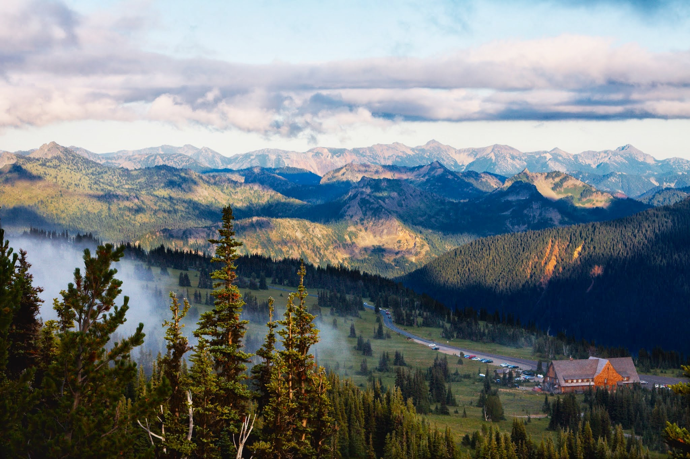
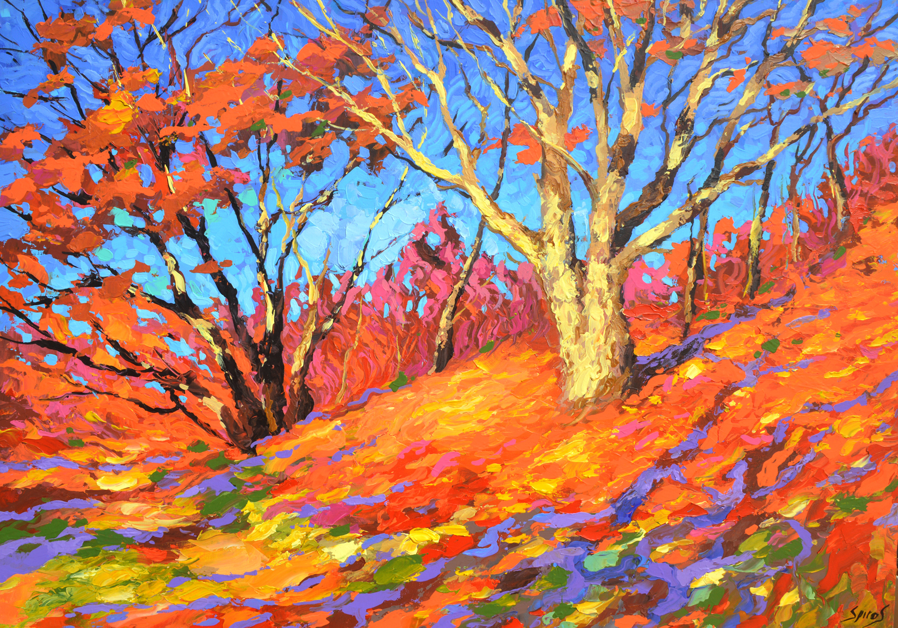
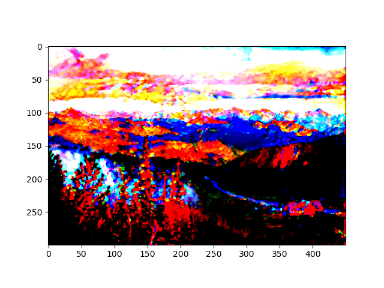

# refactoring-the-d2l-neural-style-code

《动手学深度学习》： https://github.com/d2l-ai/d2l-zh

我学习使用的代码是从 https://D2L.ai 下载到的jupyter notebook（pytorch版），参考了李沐老师在bilibili的视频
https://www.bilibili.com/video/BV1Eh41167GN/?spm_id_from=333.999.0.0&vd_source=387b6dd8c8fe08b91f4f45e6eabf1ea8。

## 介绍

重构 d2l jupyter notebook 的 chapter_computer-vision/neural-style.ipynb

---
【注】需要你下载vgg19-dcbb9e9d.pth，放到style_transfer_by_VGG19.py的同一目录。

https://download.pytorch.org/models/vgg19-dcbb9e9d.pth

---

课程中，想要让下图左学习到下图右的风格。
<table>
  <tr>
    <td></td>
    <td></td>
  </tr>
</table>

使用vgg19提取内容层特征、风格层特征，然后更新要生成图片的权重（具体看源码吧，很神奇）

选择了vgg19的第15层输出特征为内容层，第3、8、15、22层特征为风格层。         
```python
content_layers = [15]
style_layers = [3,8,15,22]
```
之前给定输入X，调用前向传播net(X)，只能获得最后一层的输出。由于还需要中间层的输出，因此这里我们逐层计算
```python
contents = [], styles = []
for i in range( len(net) ):
    X = net[i](X)
    if i in style_layers:
        styles.append(X)
    if i in content_layers:
        contents.append(X)
    return contents, styles
```

选择上述的内容层和那些风格层，out：



对比原始图：

<table>
  <tr>
    <td></td>
    <td></td>
  </tr>
</table>

## 后续更新。。。
